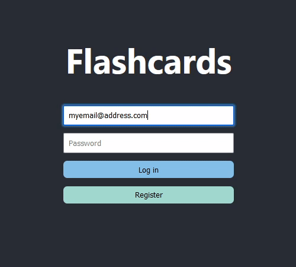

# rote-memorization

This is a sample full-stack application where the user can sign up, verify
their email address, and then review vocabulary flashcards where
German words are mapped to their translations.

## Running locally

1. Ensure that you have `node`, `npm`, `yarn` and `dbmate` globally installed
    1. `node` and `npm`: https://nodejs.org/en/
    2. `yarn`: `npm install -g yarn` (may require `sudo`)
    3. `dbmate`: https://github.com/amacneil/dbmate
2. Run `yarn setup`.
3. Set up the env variables `.env` in `apps/app/.env`, `apps/service/.env`
   and `libs/db-client/.env` with the correct values using the `.env.sample`
   files as a reference.
4. Set up the DB: `cd libs/db-client` and `dbmate up`.
5. Start the server: `cd apps/service`, `yarn build` and `yarn start`.
6. Start the app: `cd apps/app` and `yarn start`.

## Project structure

This is structured as a monorepo, using [Lerna](https://github.com/lerna/lerna) to
manage the different packages. The repo is divided in five packages:
- `apps/app`: the web client.
- `apps/service`: the backend.
- `libs/db-client`: handles DB access (server-side only).
  - Having this as a separate package is not strongly needed, but I find it's good
    practice to decouple this from the service, and I have come across projects in
    the past which implemented DB access separately for each package, so this saves
    some trouble.
- `libs/flashcard-common`: common flashcard logic.
  - In particular, both the app and the service need to know what happens to a
    flashcard after a correct/wrong answer. The service needs to update it in the DB
    and the app needs to know so that after a review it may display either the
    message saying "you're done forever" or "come back later". Having this as a
    separate package avoids duplicating this logic.
- `libs/types`: type definitions reused across the app and backend, and some helper
  functions to convert from one type to another.

In general, all code is structured in `features`. Each area of concern (`home`,
`review`, `user`, etc.) has its own subfolder, and then I further subdivide 
everything into `components`, `procedures` and so on. This helps to keep related
code together. In general I make an effort to keep both my pure functions and my
procedures as small as possible.

### App

The app is a standard React app, using Redux for application-wide state management
(right now it only contains the logged in user data), and XState for implementing the
logic inside components as a state machine. I am also using Axios for server calls,
and react-router-dom for routing across different pages. 

XState is the least common pick of the above. I chose it for two reasons:

1. First, I like my components to have as little logic as possible - ideally they
   should only render stuff. Having the component logic live separately makes it
   much easier to test the logic and the internal state than it is to test a
   component where internal state and rendering are coupled.
2. Second, I find that in some cases it prevents issues with duplicate calls. For
   instance, it gives me the ability to prevent issues when the user presses a 
   button twice (which can result in repeated API calls, a modal opening twice,
   etc.). If I am in a state where the user can press a button, pressing the
   button triggers a transition to another state where pressing the button is no
   longer allowed, so the button callback is not run the second time.

It is also using CSS for styling - I would have liked to use SCSS, but I ran out of
time to set it up.

Unfortunately I ran out of time to implement unit tests. Testing functions/procedures
and state machines would have been my top pick as I find these are the places where
I get the most benefit per time out of tests.

### Backend

The backend is implemented as an Express app running on top of a DB (right now it's
a PostgreSQL DB, but since DB access lives in a separate package, this could be
changed without needing to modify anything from the backend code).

It essentially implements two separate feature areas:

- User handling (login, registration and account validation, which do not require a
  JWT).
- Flashcard handling (getting the list of flashcards and processing answers;
  requires a JWT as the user needs to be logged in).

I am also using Nodemailer for sending emails when we want to validate a user's
email address.

### DB client

The DB access is achieved using [Zapatos](https://jawj.github.io/zapatos/), an ORM
which generates a TypeScript schema out of the database structure and offers goodies
such as autocompletion, compilation errors if I try to access an incorrect
table/field and so on.

I'm also using [dbmate](https://github.com/amacneil/dbmate) for DB migrations.

### flashcard-common

As mentioned above, I have a flashcard-common package which holds flashcard-related
logic. Apart from the concern about duplicated logic in the app of the server which
was mentioned before, I think that in general it's a good idea to have this code
separately. There were no hard requirements about whether this logic should live in
the backend or the server (e.g., maybe we could have the backend only send the
frontend the list of flashcards it needs for the current review session). Having it
in a separate package gives us more flexibility to move it from one package to
another with minimal effort.

### types

This package holds type definitions which are potentially reusable between the other
packages, including the app and the service, so that every package has the most
up-to-date version of the types without duplication.

## Deployments

The client app is meant to be living in an S3 bucket, whereas the backend
should be deployed to an Elastic Beanstalk instance.

I have written a `deploy.sh` script that takes care of setting up the correct env
files for each (assuming that there are `.env.production` files) readily available,
builds the app and the backend, uploads the app to S3 and deploys the portal to EB.

Note that deploying the backend requires some extra setup. This is because AWS does
not know how to handle a Lerna monorepo, so the easiest way around this is to modify
the package definitions so that they can be installed with a regular `npm install`.
